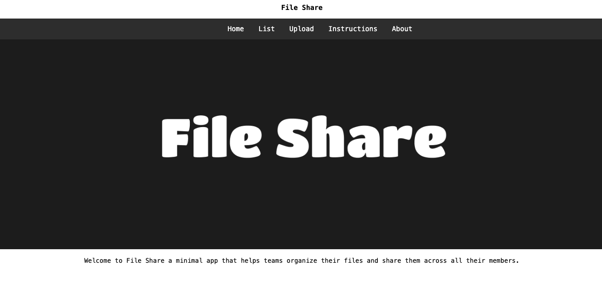

# FileShare
FileShare is a minimal app that helps you share files.



## Installation

### Requirements:

- A PostgreSQL Database with the name fileshare and a user with the ability to perform CRUD operations on it.
- .env file with the properties listed below or EXPORT ENV variables.
```
PORT={port_to_expose}
DB_USER={postgres_username}
DB_PASS={postgres_password}
DB=fileshare
DB_HOST={postgres_ip}
DB_PORT={postgres_port}
SECRET={mysupersecret}
UPLOAD=/uploads
TMP=/tmp/fileshare
LOG_FILE=/var/logs/fileshare/app.log
```
- NodeJS (v20.8.0)
> NodeJS is required for without docker installation


#### Without Docker

- Create the directories for the UPLOAD, TMP, LOG_FILE and set their paths.
- Create .env file inside FileShare directory.
- npm install
- npm start

#### With Docker:

- docker network create --subnet=10.2.2.0/24 fileshare-network
- docker compose up -d

### Uninstall FileShare

To remove FileShare simply run:

- Remove all directories that you have set in .env file or exposed.
- rm -rf FileShare

### About FileShare

FileShare was built using the following technologies:

- [Express](https://expressjs.com/)
- [express-session](https://www.npmjs.com/package/express-session)
- [Sequelize](https://sequelize.org/)
- [Multer](https://www.npmjs.com/package/multer)
- [PostgreSQL](https://www.postgresql.org/)
